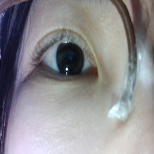
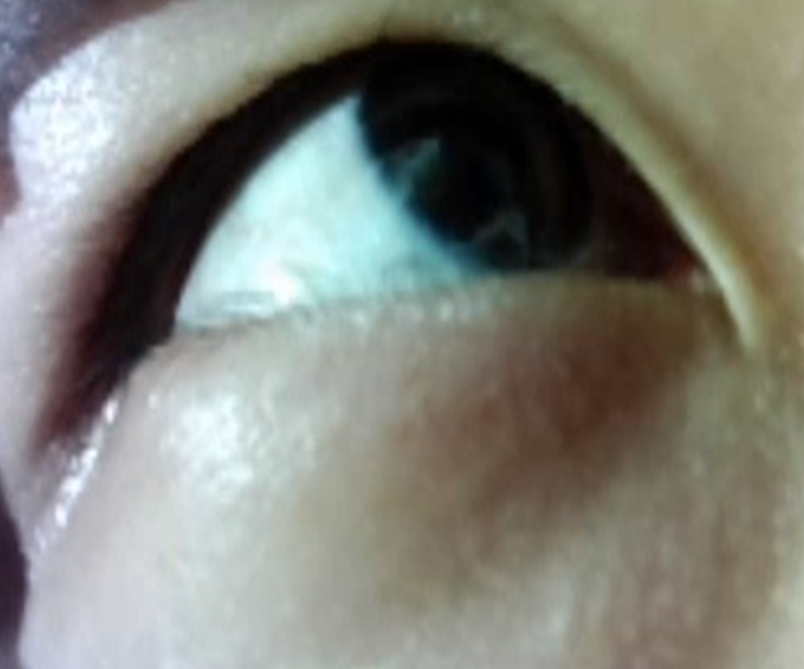
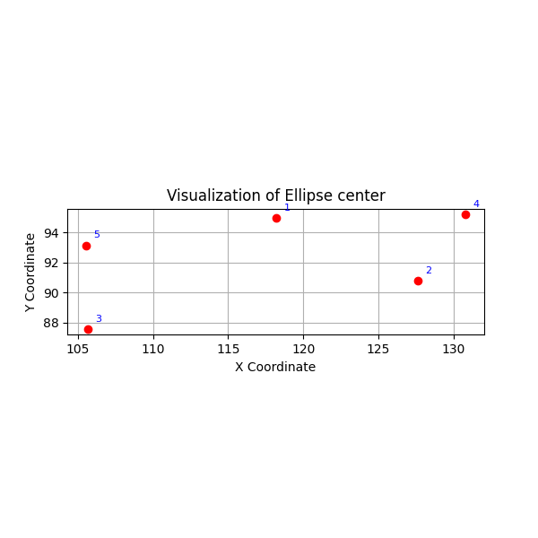
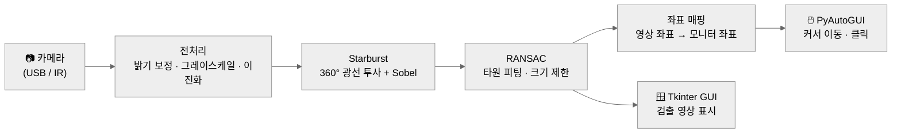
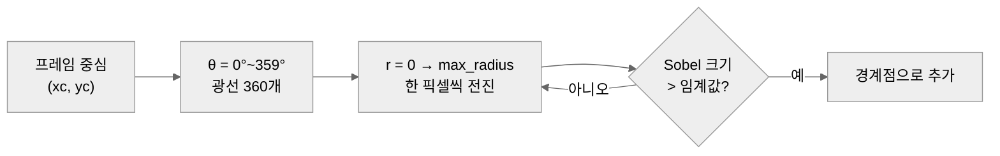

<div align="center">

# Focus

### 저가형 카메라 기반, 눈 영상만으로 동작하는 시선 추적 마우스

*눈동자의 움직임을 화면 위의 커서로*






**Starburst + RANSAC 동공 검출 · 동공 좌표 → 모니터 좌표 매핑 · 마우스 제어**

</div>

---

## 📑 목차
1. [프로젝트 개요](#-프로젝트-개요)
2. [개발 배경](#-개발-배경)
3. [개발 목표](#-개발-목표)
4. [핵심 기능](#-핵심-기능)
5. [기술 스택](#-기술-스택)
6. [시스템 구성](#-시스템-구성)
7. [동공 검출 알고리즘](#-동공-검출-알고리즘)
8. [실험 & 파라미터 튜닝](#-실험--파라미터-튜닝)
9. [버전 히스토리](#-버전-히스토리)
10. [프로젝트 구조](#-프로젝트-구조)
11. [로컬 실행 방법](#-로컬-실행-방법)
12. [한계 & 추후 계획](#-한계--추후-계획)

---

## 👁️ 프로젝트 개요

**Focus**는 저가형 카메라로 **눈만** 근접 촬영한 영상에서 동공을 검출하고, 동공 중심 좌표를 모니터 좌표로 변환해 **마우스 커서를 움직이는** 시선 추적(Eye-tracking) 프로젝트입니다.

> **눈 영상 입력 → 동공 경계 검출 → 타원 피팅 → 화면 좌표 매핑 → 마우스 이동·클릭**

| 단계 | 내용 |
|------|------|
| 하드웨어 | 3D 프린터로 만든 거치대 + 저가형(USB / IR) 카메라 |
| 동공 검출 | **Starburst**(광선 투사)로 경계점 수집 → **RANSAC**으로 타원 피팅 |
| 입력 제어 | 동공 중심 → 모니터 좌표 정규화 → `pyautogui`로 커서 이동·클릭 |
| GUI | `tkinter` 항상-위 창에 실시간 검출 영상 표시 |

---

## 📊 개발 배경

### 01. 상용 아이트래커의 진입 장벽

상용 장비는 **얼굴 전체에서 눈을 찾고 각막 반사(굴절)** 를 이용해 시선을 추정합니다. 정확도는 높지만 고성능 카메라·광원이 필요해 가격이 높고 장비가 큽니다.

| 항목 | 상용 아이트래커 | Focus |
|------|-----------------|-------|
| 촬영 대상 | 얼굴 전체 → 눈 영역 검출 | **눈만** 근접 촬영 |
| 장비 | 고성능 카메라 + 광원 | 저가형 카메라 + 3D 프린팅 거치대 |
| 크기 | 모니터 부착형 | 소형 · 휴대 가능 |

### 02. 대상 사용자

손을 쓰기 어려운 사용자(예: 루게릭병 환자)가 **눈의 움직임만으로** 컴퓨터를 조작할 수 있도록 하는 보급형 입력 장치를 목표로 합니다.

---

## 🎯 개발 목표

| 💸 보급형 가격 | 🎯 미세한 동공 추적 | 🖱️ 실사용 가능한 입력 |
|:---:|:---:|:---:|
| 시중 저가형 아이트래커의<br/>절반 이하 가격을 목표 | 눈만 촬영한 영상에서도<br/>동공 중심을 안정적으로 검출 | 동공 좌표를 화면 좌표로 변환해<br/>커서 이동·클릭까지 연결 |

---

## ✨ 핵심 기능

<p align="center">
  
  <br/><sub>Starburst 광선 투사 디버깅 — 중심점에서 360개 광선을 쏘아 경계(Sobel) 지점을 탐색</sub>
</p>

### 1. 동공 경계 검출 (Starburst)
- 프레임 중심에서 **360개 광선**을 투사하고, 이진화 + Sobel 기울기가 큰 지점을 동공 경계 후보로 수집
- 밝기 보정(`alpha=1.5`) → 그레이스케일 → 이진화(`threshold=50`) → Sobel 순으로 전처리

### 2. 타원 피팅 (RANSAC)
- 경계 후보에서 무작위 5점을 뽑아 `cv2.fitEllipse` → 경계점과의 거리 기준 inlier 개수로 평가
- 크기 제한(주축·부축 ≤ 40px)으로 눈꺼풀·속눈썹 같은 큰 오검출 타원을 제외
- inlier 비율이 기준(0.7) 이상이면 조기 종료해 계산량 절감

### 3. 화면 좌표 매핑 & 마우스 제어
- 동공 중심 `(x, y)`를 영상 크기로 정규화 → 모니터 해상도(`screeninfo`)에 곱해 화면 좌표로 변환
- 화면 경계로 클램핑 후 `pyautogui.moveTo` / `click`

### 4. 실시간 GUI
- `tkinter` 항상-위(topmost) 창에 검출 타원이 그려진 영상을 30ms 주기로 갱신

### 5. 검출 결과 시각화
- 프레임별 타원 중심점을 `matplotlib`으로 산점도 시각화해 추적 안정성 확인 (`좌표확인.py`)

---

## 🛠 기술 스택

| 분류 | 기술 |
|------|------|
| Language | Python 3.12 |
| 영상 처리 | OpenCV (`cv2`), NumPy |
| 입력 제어 | PyAutoGUI, screeninfo |
| GUI | Tkinter, Pillow (`ImageTk`) |
| 시각화 | Matplotlib |
| 하드웨어 | 3D 프린팅 거치대, USB 카메라, IR 카메라 |

---

## 🏗 시스템 구성



---

## 🔬 동공 검출 알고리즘

### Starburst — 경계점 수집



- 처음에는 경계를 찾으면 광선을 멈췄지만(`break`), 각막 반사·눈꺼풀에서 먼저 멈춰 동공까지 닿지 못하는 문제가 있어 **`max_radius`까지 계속 탐색**하도록 수정했습니다.

### RANSAC — 타원 피팅

```python
for _ in range(max_iterations):
    sample = points[np.random.choice(len(points), 5, replace=False)]
    ellipse = cv2.fitEllipse(sample)
    if ellipse[1][0] > 40 or ellipse[1][1] > 40:   # 너무 큰 타원 제외
        continue
    inliers = [p for p in points if abs(dist(p, ellipse)) <= inlier_threshold]
    # inlier가 가장 많은 타원을 채택, 비율 ≥ stop_inlier_ratio 이면 조기 종료
```

### 대안 알고리즘 실험

| 방식 | 파일 | 아이디어 |
|------|------|----------|
| Starburst + RANSAC (거리 기반) | `버전1~3.py` | 경계점-타원 거리로 inlier 판정 |
| Starburst + **Condensation** | `버전4.py`, `버전5.py` | RANSAC 대신 파티클 필터로 타원 추정 |
| Starburst + RANSAC (**밀도 기반**) | `버전6.py`, `ver7.py` | 거리 대신 타원 둘레의 inlier 밀도로 적합도 평가 |
| Canny + RANSAC + **OGD** | `버전8.py` | 초기 타원을 온라인 경사하강법으로 미세 조정 |

---

## 🧪 실험 & 파라미터 튜닝

> 전체 과정은 [`결과/수정경과.pdf`](결과/수정경과.pdf)에 정리되어 있습니다.

### `ray_casting` 수정 경과

| # | 조건 변화 | 결과 |
|---|-----------|------|
| 1 | 그레이스케일 + Sobel, `threshold=50`, `max_radius=300` | 각막 반사·눈꺼풀에서 탐색이 멈춰 동공까지 닿지 못함 |
| 2 | `threshold=70` | 눈꺼풀 쪽 엣지는 사라짐 |
| 3 | `threshold=100` | 알고리즘 유효성 확인용 |
| 4 | 그레이스케일 → **이진화** → Sobel | 이진화 후에는 Sobel 임계값이 무의미, 여전히 첫 엣지에서 탐색 중지 |
| 5 | 엣지를 찾아도 `max_radius`까지 탐색 지속 (`break` 제거) | **동공 엣지를 거의 완벽하게 탐색** |
| 6 | `max_radius=100` | 눈동자가 한쪽으로 치우쳐도 엣지 검출 양호 |
| 7 | 엣지 주변 8-이웃 픽셀 추가 검사 | 차이 없음 → 계산량만 증가해 제외 |

### 결론 — 영상마다 조정이 필요한 변수

| 변수 | 기준 | 권장 범위 |
|------|------|-----------|
| `max_radius` | 영상 크기 · 눈 크기 | 작은 영상 100 / 큰 영상 450 |
| `max_iterations` | 계산량 · 속도 | 300 (500은 더 정확하지만 느림) |
| 이진화 `threshold` | 영상 밝기 (어두울수록 낮게) | 일반 50 / 어두운 영상 20 |
| 타원 `min_length` / `max_length` | 검출되는 동공 크기 | 20~40 / 80~180 |

- 눈꺼풀이 생각보다 큰 영향을 주므로 **타원 크기 제한**이 필요
- 촬영 환경(조명·거리)이 일정하면 크기 제한 없이도 안정적 → **영상 환경이 가장 중요**

---

## 🗂 버전 히스토리

| 파일 | 입력 | 내용 |
|------|------|------|
| `11월29일.py` | 영상 | 광선 투사 + Sobel 경계점 시각화 (초기 버전) |
| `버전1.py` | 영상 (`Time2.mov`) | **GUI + Starburst + RANSAC + 클릭** |
| `버전2.py` | 영상 (`csub.mp4`) | Starburst + RANSAC (영상) |
| `버전3.py` | 이미지 (`cs7.png`) | Starburst + RANSAC (이미지) |
| `버전4.py` / `버전5.py` | 영상 / 이미지 | Starburst + Condensation |
| `버전6.py` / `ver7.py` | 영상 / 이미지 | Starburst + 밀도 기반 RANSAC |
| `버전8.py` | 영상 (`Time2.mov`) | Canny + RANSAC + OGD |
| `11월30일.py` | 영상 (`csub.mp4`) | Starburst + 마우스 이동·클릭 (수정 전 Starburst 코드) |
| `11월30일_2.py` | 영상 (`csub.mp4`) | 클래스 구조 정리 버전 (작업 중, 미완성) |
| `좌표확인.py` | — | 검출된 타원 중심점 산점도 시각화 |

---

## 📁 프로젝트 구조

```
Focus_eyetracking/
├── 버전1.py ~ 버전8.py, ver7.py   # 알고리즘 버전별 구현
├── 11월29일.py, 11월30일*.py      # 날짜별 작업 파일
├── 좌표확인.py                     # 중심점 시각화
│
├── csub.mp4, Time2.mov, 5point.mov # 테스트 영상 (일반 카메라)
├── ir4.avi, ir9.avi                # 테스트 영상 (IR 카메라)
├── csubpic/, cs9.png, cs10.png     # csub 영상 캡처 이미지
├── ir4pic/, ir9pic/                # IR 영상 캡처 이미지
├── usbcam_1120/                    # USB 카메라 촬영 이미지 (11/20)
│
└── 결과/
    ├── 수정경과.pdf / .hwpx        # 파라미터 튜닝 실험 보고서
    ├── Figure_1.png                # 타원 중심점 시각화
    └── 스크린샷 ….png              # 광선 투사 디버깅 화면
```

---

## 🚀 로컬 실행 방법

### 1. 사전 요구사항
- Python 3.10+ (개발 환경: 3.12)
- 모니터가 연결된 데스크톱 환경 (PyAutoGUI · Tkinter 사용)

### 2. 의존성 설치

```bash
pip install opencv-python numpy pyautogui screeninfo pillow matplotlib
```

### 3. 실행

```bash
# GUI + 동공 검출 + 마우스 제어
python 버전1.py

# 동공 검출만 (영상)
python 버전2.py

# 동공 검출만 (이미지) — cs7.png가 csubpic/ 안에 있으므로 경로를 "csubpic/cs7.png"로 수정 후 실행
python 버전3.py
```

- 입력 파일은 각 스크립트 하단 `if __name__ == "__main__":`에서 변경합니다. 웹캠을 쓰려면 경로 대신 `0`을 넣으면 됩니다.
- OpenCV 창에서 **`q`** 를 누르면 종료됩니다.

> ⚠️ `버전1.py`, `11월30일.py`는 **매 프레임마다 마우스를 이동하고 클릭**합니다. 멈추려면 마우스를 화면 모서리로 옮겨 PyAutoGUI fail-safe를 발동시키거나 터미널에서 `Ctrl+C`로 종료하세요.

---

## 🔭 한계 & 추후 계획

### 현재 한계
- 광선 투사 시작점이 **프레임 중심 고정** → 동공이 중심에서 멀어지면 검출이 불안정
- 눈꺼풀·각막 반사가 오검출의 주 원인이며, 영상마다 파라미터 수동 조정 필요
- `max_iterations`가 커지면 실시간 처리 속도 저하

### 추후 계획
- [ ] 이전 프레임의 동공 중심을 다음 프레임 시작점으로 사용 (추적 안정화)
- [ ] 시작 시 화면 중앙 응시로 **동공 위치 초기화(캘리브레이션)**
- [ ] 동공 영역을 확대해 미세한 움직임까지 반영 → 좌표 정밀도 향상
- [ ] 응시 시간 기반 클릭, 스크롤(Up/Down) · 화상 키보드 버튼이 있는 GUI
- [ ] 실행 파일(.exe) 패키징
